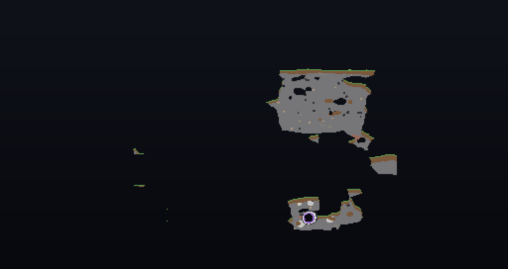

```
ACT TWO
MILESTONE 4
OCTIA_[0.2.0.T.H.R.E.A.D]_spec
SEEK KEG |ALL|
```

# THREADS — the landscape as the smallest language model available

**Set down 2026-08-23, on branch `sky-islands`.** A recommendation and one worked
artifact. Sections II to VII are **not built**; section VIII is, and generated a world.

The gardener's brief, in their words, in the order it arrived:

> custom tags per chunk per octia class ship... pilons give a code for the portals
> pattern... all patterns open up to a world if it exists... then generate one for it
>
> story threads
>
> a series of forward facing angle vectors that act as interest tensors for an overall
> story arc / story arcs are vertical and point in the direction of the story beat
>
> from a 2d graph perspective
>
> what story is the landscape telling and how can that be the smallest language model
> available... extraordinary in the ordinary... just not too... extra...

The last line is the specification. Everything above it is the mechanism.

---

## 0. The tree was asked first

`MYSTERIES.md` §0 records what it cost not to: five designers proposed writing a class
that was already sitting in the working tree. So, searched before a word of this was
written.

**Does not exist anywhere in `src/`:** any pylon, any portal, any pattern, any
per-chunk tag, any dimension registration. Zero custom `TagKey`s.
**`fabric-dimensions-v1` is on the classpath and is not used by a single line** — as
`ISLANDS.md` §VII.1 recorded, and §IX then decided against needing it.

**Already exists, and is doing nothing:**

| what | where | state |
|---|---|---|
| the lattice: a node per 512-block cell, one outgoing leg | `world/Sightlines.java` | built, 11 tests |
| **every thread closes into a ring** | `world/Ring.java` | built, tested, **zero callers** |
| a position's bearing to its node, as one of eight | `world/Mystery.java` | built, tested, **zero callers** |
| the pylon: a prism along the leg with a sighting slot bored down it | `world/ObeliskFeature.java` | built |
| **the portal frame: keystone plus four, on every node, squared across the leg** | `world/ArchFeature.java` | built |
| position identity that is the same in every world | `ship/ShipMoorings.java` | built, pinned |
| terrain as data, derived and regenerable | `tools/make-sky-noise.py` | built |

Almost nothing below is new machinery. It is wiring between seven things already
standing.

---

## I. The thesis, and why it is a constraint rather than a boast

> how can that be the smallest language model available

**The landscape is already a language model, and it has no parameters.**

Not a metaphor and not an LLM. A language model is a thing that, given a position in a
sequence, tells you what comes next. `Sightlines.leg` does exactly that: given a cell,
it names the next cell. `Ring.from` says the sequence is finite and closes. `Mystery`
gives each position a symbol from an alphabet of eight. That is an alphabet, a
grammar, and a termination rule — and its entire storage cost is **the world seed**.

So the model is:

```
alphabet   8 symbols          Mystery.RING, the eight offsets of a ring
grammar    one step per cell  Sightlines.leg - iterating a function
sentences  closed rings       Ring.from - "arithmetic, not a design choice"
parameters the seed           one long
```

Everything the mod already does with the LLM bench — `Cleric`, `Tender`, `Wayfarer` —
sits *on top of* this and is optional by design; `MYSTERIES.md` §IX notes a wayfarer
with the bench down "says almost nothing, which is *in character* rather than broken."
The landscape's story must work the same way: **with no model running at all.**

### "Extraordinary in the ordinary, just not too extra" — and it already has a number

This is the taste constraint, and this repo has measured it once already. When
`CORRIDOR` moved from 32 to 128 (`ROADMAP.md` §XII):

| | 32 | 128 |
|---|---|---|
| ground inside the corridor | 12.66% | 50.47% |
| a standing obelisk is on a thread | 20.24% | **64.07%** |
| **lift over chance** | **1.60x** | **1.27x** |

More of the world became meaningful and **each piece of it meant less.** That is "too
extra" with a decimal point on it. Any mechanism below has to be read against that
table: a story the whole map is telling is a story no part of the map is telling.

---

## II. A thread is a story, and it is already the right shape

`Ring.java`'s own javadoc, which was written before any of this was asked:

> Every thread ends in a ring. That is not a design choice, it is arithmetic... The
> walk therefore has the shape of a rho: a lead-in from wherever you started, and then
> a closed circuit it never leaves. The circuit is the interesting half and nothing has
> ever looked at it.

A rho is **exactly the shape of a story told by walking**: an approach that happens
once, and a structure that repeats. From `TRAJECTORY.traj` §XIV and `Sightlines`:

- a thread runs **11.15 legs, 5,709 blocks** before it returns on itself
- **15.17%** of cells start already on a ring
- **6.03%** of rings are two legs; **66.42%** are four
- about **248 rings** in a 41 km window
- `Ring.Circuit.legs()` is **always even** — pinned by `RingTest`

So the commonest story in an Octia world is **four beats long and comes back to where
it began.** Nobody chose that; the parity rule that killed doubling-back
(24.998% → 0.392%) produced it.

---

## III. The pattern: a ring is a word in base eight

One digit per leg, each digit the leg's bearing snapped to one of eight — which is
what `Mystery.markFor(dx, dz)` already answers, and it is already public for this
reason.

**A ring has no start, so the word must be canonicalised.** Otherwise the same circuit
entered at a different cell names a different world. The rule is the **lexicographically
least rotation**: `2604` and `0426` and `4260` and `6042` are one ring and one word,
`0426`. Implemented and demonstrated — see §VIII.

Sizes, so the space is honest rather than impressive: a four-leg ring is **4 digits of
base 8 = 4,096 patterns**; a two-leg ring is **64**. That is small on purpose. Twelve
bits is enough to be unguessable by a person and small enough that patterns are
*shared* between players, which is the point — a pattern is a thing you can tell
somebody.

---

## IV. The pylon spells it

The obelisk is the pylon and needs no change to be one. It is already a prism laid
**along the leg**, with a slot bored the full length at eye height that you sight
through. Its *direction* is therefore already legible from the ground, at range,
without text — that is what `SIGHTLINES.md` built it for.

What it does not yet do is carry its digit. `MYSTERIES.md` recommendation 3 — The Mark
— is exactly that mechanism: `PanelLight.STYLED` in one of eight ring slots, derived
from `Mystery` rather than from a `RandomSource`. **Build The Mark and the pylons start
spelling.** No new block, no new texture, no prose.

The reading is a walk: stand at a node, sight down the slot to the next, note the
digit, walk it. Four legs later you are back where you started and you have four
digits. **The word is the walk.** That is why it cannot be handed over in a chat line
and should never be.

---

## V. The arch is the portal, and it is already standing on every node

`ArchFeature`: keystone plus four, a **three-wide opening, one block thick**, squared
across the leg so you walk through it facing the way the thread runs. Built from
existing frame panels. It carries **no rarity filter on purpose** and must not grow
one: every chunk is offered and only the one holding its cell's node accepts.

That is a portal frame. It has been standing at every node for weeks with nothing on
the other side of it.

Two properties it already has that a portal wants and would otherwise have to be
argued for:

- **It never erodes.** `ROADMAP.md` §XII: *"the road is not maintained, the places
  are."* A portal that weathered would be a portal that closed at random.
- **It is oriented.** Squared across the leg means walking through it is walking
  *along the thread*. Direction is built in; a frame you can enter from either side
  would need a rule to say which way you went.

---

## VI. The story arc is vertical — on a 2D graph, not in the world

This is the part that needed the clarification and is much better for it.

Plot the thread on two axes:

```
interest
   ^
   |            *  <- climax: the beat with the steepest approach
   |         /  |
   |      /     \
   |   *         *
   | /            \
   *---------------*----> distance along the thread
  node A                 back to node A (the ring closes)
```

- the **horizontal axis** is distance walked along the thread — the legs, in order
- the **vertical axis** is *interest*, not altitude
- a **forward-facing angle vector** at each beat is the tangent: `(Δdistance,
  Δinterest)`. Its angle is the rate of rise.
- the **interest tensor** is that field of tangents over the whole ring

And because the ring closes, **the last beat's vector points back at the first.** The
dénouement lands on the exposition. A closed thread is not an incomplete story that ran
out of road; it is a complete one, and `Ring.java` proved that before anyone asked for
it.

This is Freytag's pyramid, which is the shape this estate is named after.

### Interest is already a measured field, so it does not need inventing

`CORRIDOR = 128` and the sweep behind it already give every block in the world a
number: how near the thread it is, and therefore how likely a pylon there is to be
standing. **Proximity to the thread is the interest field.** The tangent at a beat is
the change in that field from one node to the next, and the whole arc is computable
from `(seed, ring)` with no storage.

### And the horizontal/vertical split is already law in this codebase

`ShipMoorings` is keyed by `BlockPos` with **no dimension**, deliberately, and
`ShipGameTest.mooringsAreDimensionAgnostic` is named for it. `EraEcho` learned the
matching lesson the hard way and wrote it down:

> What travels between eras is **the column**, never the point.

Read those two together and the split falls out:

| axis | what it is | across worlds |
|---|---|---|
| **horizontal (x, z)** | the thread, the route, the pattern | **identical** — the same mooring in every world |
| **vertical (y)** | the beat, the intensity, the story | **local** — dimensions do not share a vertical range |

So a thread is the *same story* in every world, told at *different intensities*. That
is not a metaphor bolted on; it is what the store already does, and `EraEcho` already
broke once by forgetting it.

### If a vertical mark is ever wanted in the world, the object exists

The ring of eight panels is the 2D bearing and `Mystery` fills it. A **derelict is
twenty-six panels around one core** — the full 3x3x3 shell, with `dy == 0` the
erosion-exempt slice. Twenty-six offsets is every direction including up and down. So a
three-dimensional mark needs no new block either; it needs the other eighteen panels of
a cube the mod has been building since `ROADMAP.md` §IV.

---

## VII. Per-chunk tags: do not store them, compute them

> custom tags per chunk per octia class ship

The intent is right and `TagKey` is the wrong primitive — Minecraft tags label registry
entries, not chunks. `fabric-data-attachment-api-v1` is on the classpath and would
work.

**It should not be used.** A chunk's pattern is
`Ring.from(seed, cell(x), cell(z))` canonicalised — a **pure function of (seed,
position)**, exactly like `Sightlines` and `Mystery`, and for the reason both of their
javadocs give: features run on several chunk-generation workers at once, so anything
they consult must be a function rather than a lookup. No `SavedData`, no attachment, no
shared mutable anything.

Stored, it would need migrating, could disagree with the lattice, and would have to be
written before it could be read. Computed, it is correct in a world made yesterday and
in one made next year, and it costs a `HashMap` walk of about eleven steps.

This is the same argument that made `Sightlines` pure and it has already paid once.

---

## VIII. All patterns have a world — built, and one was generated

> all patterns open up to a world if it exists... then generate one for it

**Every pattern has a world, because the pattern *is* the generator.** The digits
derive the terrain knobs, so "does the world exist" is not a question about storage —
it is the question **has anyone ever opened it.**

Built into `tools/make-sky-noise.py --pattern WORD`, which writes both the noise
settings and the world preset:

```powershell
python tools\make-sky-noise.py --pattern 2604
```

```
pattern 2604 canonicalises to 0426 (a ring has no start)
pattern 0426 -> gain=1 bias=0.1 swell=0.8 scale=0.06 sea=-64 aquifers=False
wrote src/main/resources/data/octia/worldgen/noise_settings/thread_0426.json
wrote src/main/resources/data/octia/worldgen/world_preset/thread_0426.json
```

The derivation is bounded on purpose — `make-sky-noise`'s own note records that density
is clamped to [-1, 1] before use, so every knob stays inside the range `octia:sky` was
tuned in:

| knob | from |
|---|---|
| `bias` | digit sum mod 5, times 0.05 |
| `swell` | 0.2 + (number of turns mod 5) x 0.15 |
| `swell-scale` | 0.06 + (legs mod 4) x 0.02 |
| `sea_level` | **-64, always** |
| `aquifers` | **off, always** |

**Every pattern world is dry, and that is a constraint rather than a preference.**
`octia:sky` put `sea_level 96` over a band whose `min_y` is 0, on a generator with no
floor, and the sea drains out of the bottom of the world — measured, `ISLANDS.md` §X.
Until that has a floor, a generator that could ship the same leak four thousand times
does not get water.

### It generated, and it is the archipelago the island work was after

`tools/new-world.ps1 -Seed 1 -Type thread_0426 -Chunks 6`, read back with
`chunk-probe.py`:

```
terrain : octia:thread_0426
beacon raised at BlockPos{x=0, y=185, z=14}
169 chunks generated
```



| | vanilla `floating_islands` | shipped `octia:sky` | **`octia:thread_0426`** |
|---|---|---|---|
| median rock per chunk | 13.21% | 29.20% | **1.65%** |
| median fluid | 0 | 18,059 | **0** |
| completely empty chunks | 3.4% | 0.0% | **34.9%** |
| chunks with no fluid | 76.4% | 0.0% | **84.0%** |
| draining | no | **yes** | **no** |

A third of its chunks are nothing at all. **This clears `ISLANDS.md` §I's scarcity bar
and the shipped terrain does not** — and it came out of a four-digit word rather than
out of an afternoon of tuning. That is the strongest argument in this document and it
was not the argument it set out to make.

`ISLANDS.md` §X asks whether to return to the `isle` rung. This is a third answer:
**let the pattern pick.**

### Two decisions inside that, stated out loud

- **A pattern world is not tagged into `minecraft:normal`.** It does **not** appear on
  the world-type button, deliberately: a pattern world is reached by finding its
  thread, not by scrolling a list. `octia:sky` is tagged, and stays tagged, because it
  is the front door.
- **The Python does not compute the word and must never learn how.** `Ring.from` and
  `Sightlines.step` are Java. `ROADMAP.md` records what happened last time a Python
  tool transposed the lattice: `sightline-map.py` drew a different lattice than the
  game for **12.7% of cells**, and the check meant to catch it compared **four cells**
  — *"a coin flip dressed as a gate."* The word arrives as an argument, read off the
  world by something that *is* the lattice.

---

## IX. What this costs

Nothing here needs a mixin, a block entity, an access widener, a new block, a new
texture, or a line of prose. It needs:

1. **The Mark** (`MYSTERIES.md` rec. 3) so a pylon carries its digit. Two call sites,
   both identified there, one of them ordering-critical and already verified.
2. **A word reader** — `Thread.word(seed, cellX, cellZ)` beside `Ring`, pure, returning
   the canonical rotation. Perhaps thirty lines and a JUnit test.
3. **The arch doing something** when the thread you walked in on matches a pattern with
   a world. This is the only genuinely new mechanism, and it is where
   `fabric-dimensions-v1` finally gets used.

Item 3 is the one to be careful about. Everything before it is legible and cheap;
opening a dimension is the first thing in this mod that would take a player somewhere
they cannot walk back from.

---

## X. Open, and refused rather than decided silently

1. **Does a pattern world persist?** A world per pattern is 4,096 possible saves. Either
   they are generated on demand and discarded, or the first person through a thread
   *makes* one that stays. These are different games and the second is a storage
   question `worlds/README.md` already has opinions about.
2. **What does the arch do when the pattern has no world?** "If it exists" was the
   gardener's phrase. Under §VIII every pattern has one, so the honest reading is
   *nobody has opened it* — and an arch that opens anything, always, is a fast-travel
   network rather than a mystery.
3. **Is the vertical axis ever shown in the world, or only reasoned about?**
   §VI says the arc is a graph. If a beat's intensity is never perceptible, `EraEcho`'s
   standard applies: *a property nobody can perceive is a comment with a test
   attached.*
4. **`|SCOPE|` is still open** (`AGENTS.md` §VII.1) and this document does not depend
   on it. Recorded so the next hand knows it was checked.
5. **Does a thread cross worlds unchanged?** §VI says horizontal position is identical
   in every world because `ShipMoorings` says so. But the *lattice* is a function of
   the **seed**, and a pattern world generated from a word has a seed of its own. So
   either a pattern world inherits its parent's seed — and the thread continues — or it
   does not, and arriving somewhere means arriving in a different story. **Not decided,
   and it is the most consequential line in this file.**

---

## XI. Not measured — say it out loud

`SIGHTLINES.md` ran 200 seeds over 2,040,200 cells. That is the standard. None of these
meets it.

1. **How much information a leg's octant actually carries.** `Sightlines.step` picks a
   **cardinal** — two bits — but a leg bends up to *"about 31 degrees"* on the jitter,
   and an octant boundary is at 22.5. So some legs snap to a diagonal and some do not,
   and **that is where the third bit comes from.** If diagonals are rare the word
   collapses toward two bits a leg and the pattern space is 256, not 4,096. Nobody has
   this number and everything in §III rests on it. It is pure JUnit and costs
   milliseconds.
2. **The distribution of canonical words.** Least-rotation canonicalisation collapses
   rotations, so patterns are not uniform — `0000` has one rotation and `0426` has
   four. How lumpy is unknown.
3. **The arch refusal rate**, still. `MYSTERIES.md` §VI.1 gates The Mark on it, and The
   Mark gates §IV. A node whose ground refused an arch is a portal that is not there.
4. **Whether a walked thread is walkable.** 5,709 blocks and 11 legs is a measurement
   of the lattice, not of a person. Nobody has walked one.
5. **What the lattice does on sky terrain at all** — `ISLANDS.md` §X.2. All four debug
   readouts from the 22:22-22:27 playtest say `obelisks: 1 (within 1024b of you)`. If
   pylons are that sparse on `octia:sky`, a word cannot be read off the world, and
   §IV's walk is a walk between things that are not there. **This is the first thing to
   measure and it may invalidate the mechanism rather than tune it.**

The world is the source of truth, not this document. `Ring.java` and `Mystery.java`
were sitting in the tree with zero callers while this was being asked for.

`[2026-08-23]`
