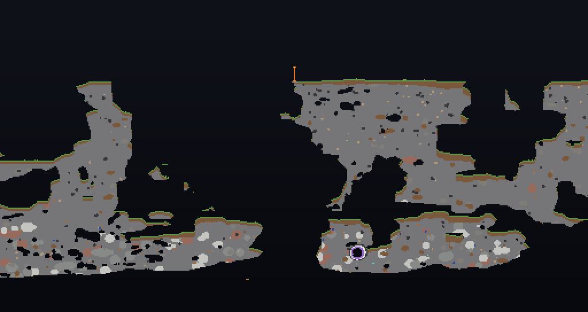
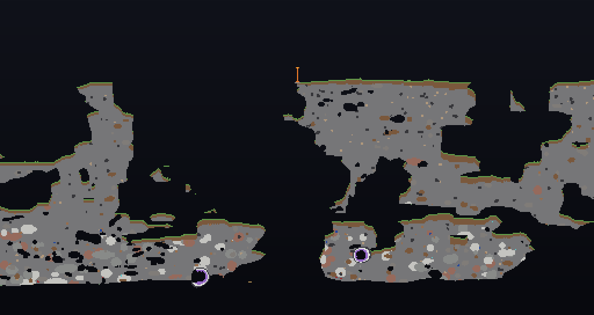
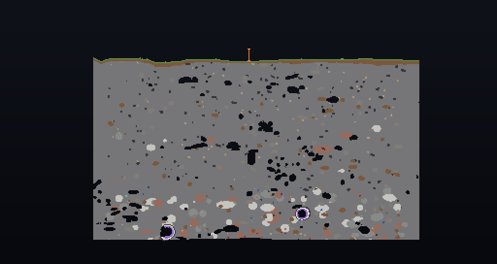
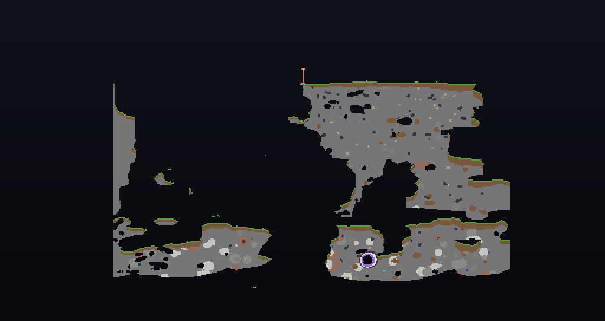
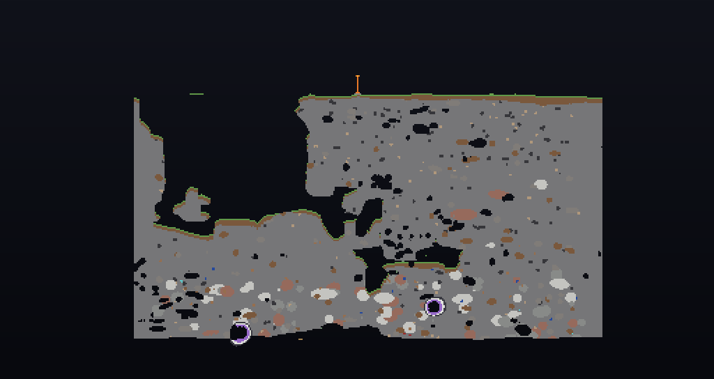
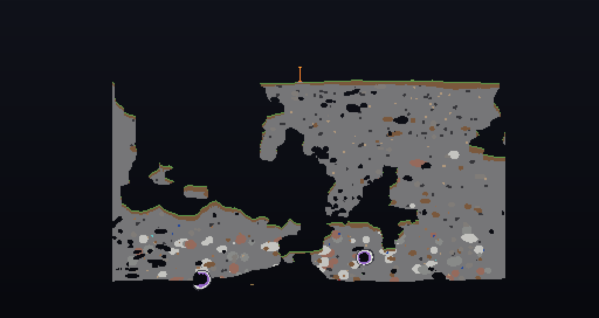
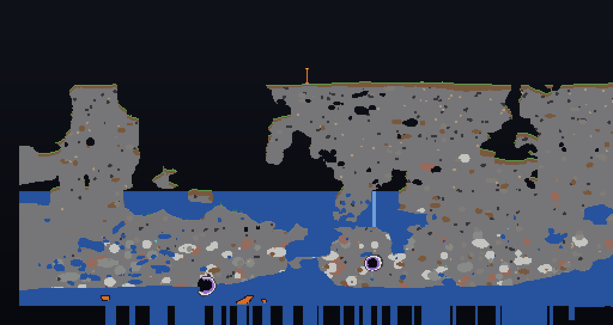

```
ACT TWO
MILESTONE 2
OCTIA_[0.2.0.S.L.I.C.E]_evidence
SEEK KEG |ALL|
```

# slices/ — what the sky terrain actually generated, rung by rung

**Set down 2026-08-23.** Seven vertical cross-sections through the seven saves of
that evening's terrain search, read out of the region files by
[`tools/chunk-probe.py`](../../tools/chunk-probe.py) without launching the game.

Every one is the same cut on the same seed: **seed 1, z=0, x −256..256, y −16..256,
scale 2**. So they can be read against each other, and the reading is the point.

**These slices are the only surviving record of rungs 1 to 5.** Each rung
regenerated `data/octia/worldgen/noise_settings/sky.json`, and only the last of
those seven versions was ever committed. The intermediate settings are gone; the
terrain they produced is here. 81 KB for the set, against ~90 MB had the saves
themselves been snapshotted — see [`../README.md`](../README.md) on that trade.

---

## The strip

### rung 0 — `sky`, the control: vanilla `minecraft:floating_islands`



Separate masses, grass-skinned, with real void between them and geodes inside.
Dry. This is the shape everything below is measured against.

### rung 1 — `gain`



Visually indistinguishable from rung 0, and **nearly but not quite identical** —
see §*The gain no-op, re-examined* below.

### rung 2 — `bias`



Solid. A flat grass table over unbroken stone from the surface to the bottom of the
band, edge to edge; the vertical cut-offs at either side are the edge of the
generated area, not terrain. No void anywhere. `make-sky-noise.py` predicted this
in writing before it was run — *"On its own it fills the world in, which is the
opposite of the goal."*

### rung 3 — `isle`



**The archipelago.** Distinct masses, deep gulfs, dry, and statistically
indistinguishable from vanilla on density while running octia's own settings. On
the stated goal this is the best rung in the ladder.

### rung 4 — `mass`



Back toward solid. 41% rock, no empty chunks.

### rung 5 — `tune`



The landing: one large mass with substantial internal gulfs, roughly 2.2× vanilla's
rock. Dry.

### rung 6 — `sea`, and what shipped



Rung 5's rock with **every void below y=96 filled with water.** The world the mod
currently generates.

---

## The numbers

`chunk-probe.py --profile`, over every full chunk in each save. Percentages are of
a full 384-tall overworld column stack, kept as the denominator so a sky save reads
against an ordinary one.

| rung | median rock | median fluid | empty chunks | chunks with no fluid | chunks measured |
|---|---|---|---|---|---|
| 0 `sky` *(vanilla)* | 12,983 — **13.21%** | 0 | 37 — 3.4% | 832 — 76.4% | 1089 |
| 1 `gain` | 13,936 — 14.18% | 0 | 36 — 3.3% | 814 — 74.7% | 1089 |
| 2 `bias` | 45,964 — 46.76% | 0 | 0 — 0.0% | 179 — 61.9% | 289 |
| 3 `isle` | 12,940 — **13.16%** | 0 | 7 — 2.4% | 225 — 77.9% | 289 |
| 4 `mass` | 40,396 — 41.09% | 0 | 0 — 0.0% | 187 — 64.7% | 289 |
| 5 `tune` | 28,249 — 28.74% | 0 | 0 — 0.0% | 193 — 66.8% | 289 |
| 6 `sea` *(shipped)* | 28,700 — **29.20%** | **18,059** | 0 — 0.0% | **0 — 0.0%** | 1681 |

**Read the last two columns of rung 6 before anything else.** Not one chunk in
1,681 is empty, and not one chunk is dry. Vanilla, on the same seed, leaves 3.4% of
chunks entirely void and 76.4% of them without a drop of water in them.

**Coverage is not equal and it matters.** Rungs 2–5 were generated over 289 chunks;
rungs 0 and 1 over 1,089; rung 6 over 1,681 because it was also played. A median
over 289 chunks is a fair median and a tail over 289 chunks is not, so the min and
max columns of the middle rungs are weaker evidence than their medians.

---

## Rung 6 is rung 5, flooded

`0_5_5_tune` against `0_5_6_sea`, block by block, full chunks only, over the slice's
own column range:

- **18.30%** of cells differ (12,740 of 69,632)
- **99.5%** of the difference is **below y=96**; above it, 0.5%
- **89.5%** of the substitutions are **air → water** (11,403 of 12,740)

The rest is the surface rule answering correctly to being submerged —
`grass_block → gravel`, `dirt → stone` — plus 90 `bubble_column` and 45 `lava`.

So the last step in the search **did not tune the terrain.** It moved `sea_level`
from −64 to 96 and switched aquifers on, and the world's caverns filled. Rock moved
by half a percent.

---

## Where `octia:sky` diverges from vanilla

Read out of the jar and out of the committed JSON, not from memory
(`AGENTS.md` §V):

| key | vanilla `floating_islands` | `octia:sky` |
|---|---|---|
| `sea_level` | **−64** | **96** |
| `aquifers_enabled` | **false** | **true** |
| `disable_mob_generation` | false | false |
| `ore_veins_enabled` | false | false |
| `legacy_random_source` | true | true |
| `noise.min_y` / `height` | 0 / 256 | 0 / 256 |
| `default_block` / `default_fluid` | stone / water | stone / water |

Two keys, and they are the whole of rung 6. Everything else `octia:sky` changes is
the density term itself.

**`docs/ISLANDS.md` §IX says "sea level at −64".** That was true when it was
written on 2026-08-22 and is not true now. Corrected in that file's §X rather than
edited there, per the house rule.

---

## The gain no-op, re-examined

`make-sky-noise.py` records, correctly and usefully, that **multiplying a field by a
positive constant cannot move a zero crossing**, so gain alone changes no terrain.
The arithmetic is right and the warning should stay.

The *evidence* offered for it does not hold. The docstring says the regenerated
terrain was "IDENTICAL to vanilla block for block — the spawn column matched to the
line." Measured over the whole slice, rung 0 against rung 1:

- **2.15%** of cells differ (2,821 of 131,072)
- concentrated at **y 0..15 (11.9%)** and **y 16..31 (16.9%)** — the bottom of the band
- almost entirely **air → stone**, `diorite`, `granite`, `andesite`

In the y 176..191 band, where seed 1's spawn column sits, only **3.6%** of cells
differ. A single column checked there had roughly a 96% chance of matching whatever
else had changed. **The check passed because it was taken in the band least able to
fail it** — the same shape as the four-cell lattice check in `ROADMAP.md`, and the
same lesson: *when a check exists to catch drift, size it against the drift rate.*

What else moved alongside gain at rung 1 cannot be recovered, because that rung's
`sky.json` was never committed. That is the gap this directory exists to stop
happening again.

---

## A new world generates exactly this

Asked and answered rather than assumed. A fresh seed-1 save generated headlessly on
this date, after the provenance comment landed, against the played `sea` save over the
same column range, **full chunks only**:

- **0.32%** of cells differ (168 of 53,248)
- the substitutions are `bubble_column → water` (90), `obsidian → lava` (30),
  `water → air` (7) — fluid still settling and lava that had chilled where it met it
- about **0.06%** is rock

So terrain is reproducible from the seed, and the strip above describes what a player
gets. Terrain is `noise_settings/sky.json` referenced by `world_preset/sky.json`,
shipped in the jar; no Java decides a block of it. `SkyChoice` moves the world-type
button and `Landfall` guarantees ground under spawn afterwards — neither shapes ground.

**An existing save keeps its chunks.** Changing `sky.json` reaches newly generated ones
only, so an old world shows a seam rather than re-shaping. Every save under `run/saves`
is a record of the settings of the hour it was made, which is the whole reason this
directory exists.

---

## The underside, and the leak


The fresh save at `y −20..40`, scale 4. The world's floor is a flat sheet of **water**
stopping dead at the band's bottom — and **3,756 blocks of it are already below y=0**,
where nothing generates at all.

They sit in exactly **25 of 169** chunks: the ones around spawn, which are the ones the
server ticked. Generation touched all 169 equally. **The sea is draining out of the
bottom of the world**, and it starts wherever a player loads chunks.

`sea_level: 96` and `aquifers_enabled: true` over a band whose `min_y` is 0, on a
generator with no floor and no bedrock. Vanilla sets `sea_level` to −64 so that no
water is ever placed. Argued at length in
[`../../docs/ISLANDS.md`](../../docs/ISLANDS.md) §X.

---

## Three defects in the instrument, found by pointing it at these worlds

All three are fixed in `chunk-probe.py` as of this date, and all three had been
silently wrong.

1. **`"air"` was a substring rule, and `"air"` is a substring of `"stairs"`.** So
   `minecraft:stone_brick_stairs`, and every one of a trial chamber's
   `waxed_*_cut_copper_stairs`, rendered as **void** — in the one tool whose whole
   purpose is answering *is there void here*. Air is matched exactly now and is out
   of the substring table entirely. Any three-letter key in a substring table is
   the same trap.
2. **`--profile` counted water as solid, and counted `cave_air` as solid too.** The
   old test was `!= "minecraft:air"`, which `cave_air` and `void_air` both pass. So
   every cave inflated the density figure, and on a world with aquifers switched on
   a flooded cavern scored exactly like a cavern packed with stone — which is the
   difference between an archipelago and a bathtub. Rock and fluid are counted
   apart now.
3. **The headline `VERDICT` was wrong on both kinds of world it exists to tell
   apart.** Its rule was *"nothing below y=0, or it is not a sky world"*, and it
   failed in opposite directions: it called the genuine `octia:sky` save **not a sky
   world** because of the leaked water, and it called **vanilla `floating_islands` not
   a sky world either** — because a trial chamber generates at y −16 to −47, hanging
   in the void. Structures place in dimension space, −64..320, not in the noise band.
   Presence below the band proves nothing; the tell is a **ratio**. An ordinary
   overworld has rock under every chunk (451/451 measured), a floating one under the
   few that caught a structure (10/1089). And the drain check is now only asked of a
   floorless band, because water under y=0 on an ordinary world is an ocean.

Also: 57 block kinds in these saves had no palette entry and were drawn magenta,
including `glow_lichen`, `lapis_ore`, `diamond_ore`, `short_grass`, the whole
amethyst geode, and every ruined-portal block. The palette now covers them, and a
name that still falls through is **printed to stderr with a count** rather than only
coloured — a hole in a thin seam is a few pixels nobody ever notices.

---

## Regenerating this strip

```powershell
python tools\chunk-probe.py "run\saves\<save>" --profile
python tools\chunk-probe.py "run\saves\<save>" --slice 0 --x -256 256 --y -16 256 --scale 2 --out worlds\slices\<rung>.png
```

The framing is deliberate. `−256..256` is wide enough that a continent does not
end inside the frame; `y −16` is below the noise band's floor at 0, so the void
under the world is in the picture and cannot be assumed.

`[2026-08-23]`
